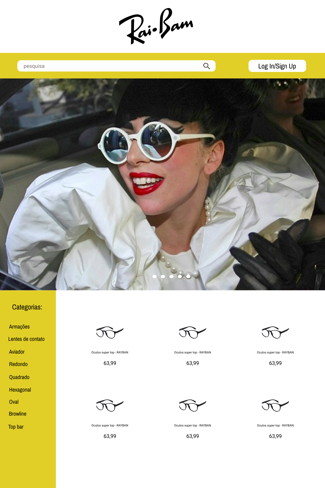
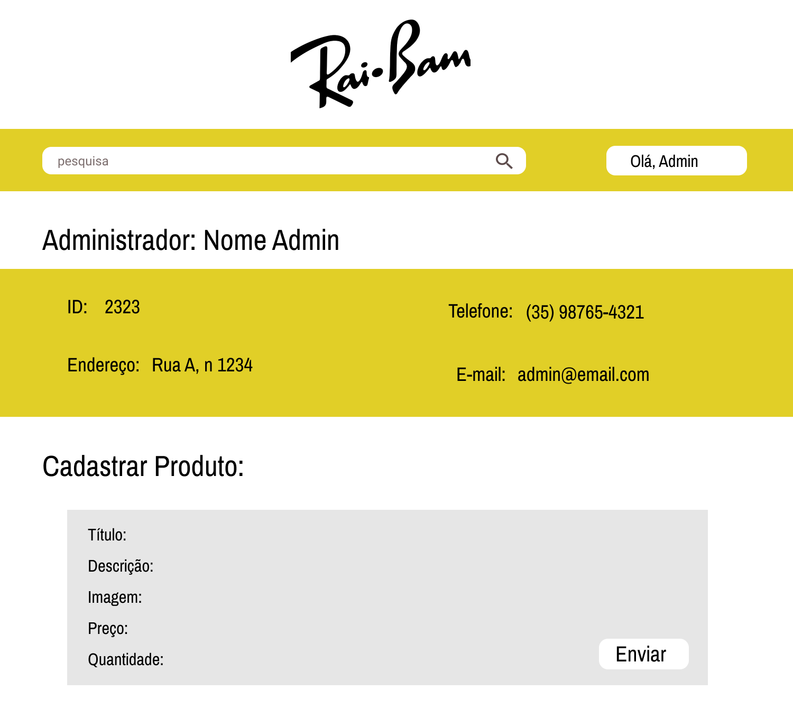


Grupo 10:

Igor Lovatto - n° USP: 10439099

Leonardo Vinicius de Almeida - n° USP: 10392230

Nathielle Pereira - n° USP: 10390252

Stéfane Tame Monteiro Oliveira - n° USP: 10829970

Project Milestone 1: Store Mockups 
==================================

1.  **Requisitos**

    Para projetar as principais telas do sistema da loja online foi
utilizado o site [https://www.figma.com](https://www.google.com/url?q=https://www.figma.com/&sa=D&source=editors&ust=1622588529324000&usg=AOvVaw0_sGHTH0xBkSHC4Sp0VXfy)
onde pudemos fazer o layout com facilidade e idealizar o
site. Para implementar o HTML e CSS de pelo menos três telas, tivemos auxílio
de um plugin chamado Figma to HTML, mas tivemos que fazer muitas
alterações para chegar no que esperávamos.

**OLD:  Para abrir as paginas mockups em html, por favor utilizem a extensão LiveServerr no editor de texto Visual Code

2.  **Descrição do Projeto**

    O produto escolhido para nossa loja online serão os óculos. Com isso,
foi criada uma página principal para apresentar os principais produtos
para gerar o interesse do cliente em comprar. A partir dela, tem a opção
de criar cadastros para os clientes, buscar produtos e ver todas as
categorias disponíveis de óculos no site.

O sistema está dividido em duas classes de acesso, sendo elas:

-   Cliente: permite fazer compras de itens na loja e criação de
    cadastros
-   Administrador: permite gerenciar e cadastrar novos itens na base de
    dados da loja

        Para efetuar a compra de um produto, o cliente deve entrar no
seu cadastro, adicionar os produtos no seu carrinho, ir no perfil para
efetuar a compra, preencher seus dados e enviar.

        A funcionalidade escolhida para o site será a experimentação de
óculos pelo próprio perfil do cliente, onde o mesmo deve cadastrar sua
foto e escolher algum óculos em seu carrinho, que automaticamente o
sistema simulará que a foto do cliente esteja com o óculos escolhido.

        Segue abaixo o diagrama de navegação das páginas principais do
site da loja online:

Figura 1: Diagrama de navegação da loja online

2.1 Páginas da loja

        A páginas geradas no figma foram:

-   Página Principal: o usuário tem acesso ao campo de busca da loja; ao
    login e cadastro de usuários; à belas fotos para chamar atenção dos
    clientes; ao menu lateral de categorias de itens; e, por fim, a
    vitrine de itens mais vendidos.
-   Página de Login: o usuário insere seus dados pessoais para acesso à
    plataforma.
-   Página do Administrador: o administrador, após o login, pode
    gerenciar e cadastrar novos itens na base de dados do sistema por
    meio de um formulário, além de exibir os dados do usuário
    administrador.
-   Página do Cliente: o usuário, após o login, pode acessar seu
    carrinho de compras; confirmar compra de itens; e fazer upload de
    uma foto para teste do óculos. Além disso, a página exibe os dados
    cadastrados do usuário.
-   Página dos Produtos: são listados os produtos a partir dos filtros
    utilizados pelo usuário, sendo eles fornecidos pelo campo de busca
    ou menu lateral de categorias.
-   Página de Venda: o usuário, após confirmar os itens desejados no
    carrinho, insere os dados relacionados ao cartão de crédito
    utilizado no pagamento e realiza a confirmação da compra.

Link do figma:

https://www.figma.com/file/8u2Yh7larxHW23YDWWXqId/Trabalho-WEB?node-id=0%3A1

Figura 2: Página Principal

Figura 3: Página de Login

Figura 4: Página do Administrador

Figura 5: Página do Cliente

Figura 6: Página de Listagem dos Produtos

Figura 7: Página de Pagamento

3.  **Comentários sobre o Código**
4.  **Plano de Teste**
5.  **Resultado do Teste**
6.  **Procedimento de Compilação**
7.  **Problemas**
8.  **Comentários**

